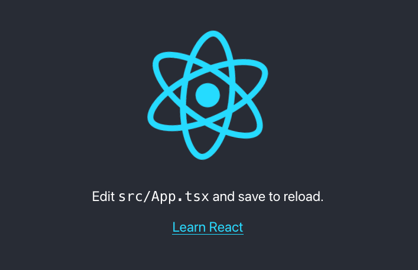

# lernaを使ったReactサンプルアプリ作成環境構築手順

---

## lernaプロジェクト作成

* プロジェクト作成
    ```
    $ cd ReactSampleProject
    $ lerna init
    $ ls
    lerna.json      package.json    packages
    ```

* lerna.jsonを編集
    ```
    {
    +   "npmClient": "yarn",
        "packages": [
            "packages/*"
        ],
        "version": "0.0.0"
    }
    ```

---

## Reactアプリプロジェクトを作成

* packages/直下で `create-react-app` を実行（`webapp`という名前で作成）
    ```
    $ cd packages/
    $ npx create-react-app webapp --template typescript
    ```

* 以下を実行
    ```
    $ npm install
    ```

* プロジェクト作成完了を確認するために、プロジェクトルートに戻ってから以下を実行
    ```
    $ cd ../
    $ lerna clean
    $ lerna bootstrap
    $ lerna run start
    ```

    * `lerna run start` でブラウザが立ち上がれば成功

        

---

## 共通モジュールパッケージの作成

Reactアプリとは分離する形でパッケージを追加する。ここではAPI呼び出し処理をパッケージ化して、Reactアプリから呼び出すことにする。
ここで、`lerna create`でパッケージを作成する際に、`git`の設定をしていないとエラーになるので、予め設定しておく。

```
$ git config user.name <your-name>
$ git config user.email <your-email>
```

* パッケージを作成（対話形式で質問されるが、基本的にデフォルトのままで問題ない）
    ```
    $ lerna create api
    ```

* apiパッケージにtypescriptを導入する
    ```
    $ lerna add --scope api -D typescript
    ```

* `api`パッケージの`package.json`（`api/package.json`）に`type: module`を追記（ `import` できるようにする）
    ```json
     "main": "dist/api.js",
    +"type": "module",
    ```

* `api`パッケージの `package.json`（`api/package.json`）に`tsconfig`の設定を書いておく
    ```json
    "scripts": {
        "test": "echo \"Error: run tests from root\" && exit 1",
    +   "build": "tsc"
    },
    ```

* 以下を実行。 `tsconfig.json` が`api`直下に追加される
    ```
    $ lerna run --scope api build -- -- --init
    ```

    *  `tsconfig.json` の構成については以下の通り
        ```
        + "outDir": "./dist", 
        + "rootDir": "./lib", 
        + "declaration": true,
        ```

        ```
            },
        +   "exclude": [
        +       "__tests__",
        +       "dist/"
        +   ]
        }
        ```

* `api.js` を `api.ts` にリネーム
    ```
    $ mv ./packages/api/lib/api.js ./packages/api/lib/api.ts
    ```

* `api/package.json` を修正
    ```
    +   "main": "dist/api.js",
    -   "main": "lib/api.js",
    ```

* 下記を実行すると、 `api/dist/api.js` が生成される
    ```
    $ lerna run --scope api build
    ```


---

## 共通コンポーネントパッケージの作成

* パッケージを作成
    ```
    $ lerna create components
    ```

* TypeScriptを導入
    ```
    $ lerna add --scope=components -D typescript
    ```

* `components` パッケージの `package.json`（`components/package.json`）に`tsconfig`の設定を書いておく
    ```
    "scripts": {
        "test": "echo \"Error: run tests from root\" && exit 1",
    +   "build": "tsc"
    },
    ``` 

* 以下を実行。 `tsconfig.json` が`api`直下に追加される
    ```
    $ lerna run --scope api build -- -- --init
    ```

    *  `tsconfig.json` の構成については以下の通り。この設定が正しくないと `React Component`をWebアプリからインポートできないので注意
        ```
        + "outDir": "./dist", 
        + "rootDir": "./lib", 
        + "jsx": "react",
        + "declaration": true,
        + "noImplicitAny": true,  
        + "noImplicitThis": true, 
        + "noUnusedLocals": true,   
        ```

        ```
            },
        +   "exclude": [
        +       "__tests__",
        +       "dist/"
        +   ]
        }
        ```

* `components.js` を `components.ts` にリネーム
    ```
    $ mv ./packages/components/lib/components.js ./packages/components/lib/components.ts
    ```

* `components/package.json` を修正
    ```
    +   "main": "dist/api.js",
    -   "main": "lib/api.js",
    ```

* 下記を実行すると、 `components/dist/components.js` が生成される
    ```
    $ lerna run --scope=components build
    ```

---

## ライブラリの導入

プロジェクト全体で使用するライブラリを導入する。各パッケージの`packages.json`の`dependencies`にライブラリが追加される。

```
$ lerna add connected-react-router
$ lerna add history@4.10.1 
$ lerna add react-redux 
$ lerna add redux
$ lerna add redux-actions 
$ lerna add redux-logger 
$ lerna add redux-thunk 
$ lerna add reselect
$ lerna add react-router
$ lerna add @types/react-router
$ lerna add react-router-dom
$ lerna add @types/react-router-dom
$ lerna add react-helmet
$ lerna add @types/react-helmet
$ lerna add @material-ui/core 
$ lerna add @material-ui/icons
$ lerna add @material-ui/styles
$ lerna add @material-ui/lab 
```

### 補足

* `history`はバグがあるため最新の`5.x`ではなく`4.x`を導入する。

* `@types/`とついたものはTypescript環境で必要な依存関係

---

## 適当なコンポーネントを作ってみる

* ソースコードファイルを作成
    ```
    $ mkdir packages/components/lib/src
    $ touch packages/components/lib/src/TestComponent.tsx
    ```

* `TestComponent.tsx` を記述
    ```javascript
    import React from 'react';
    const TestComponent = () => {
        return (
            <div>React!!</div>
        );
    }

    export default TestComponent;
    ```

* `index.ts`を編集
    ```javascript
    export { default as TestComponent } from './src/TestComponent';
    ```

* `components`パッケージの依存関係を`webapp`に追加する
    ```
    $ lerna add components --scope=webapp
    ```

---

